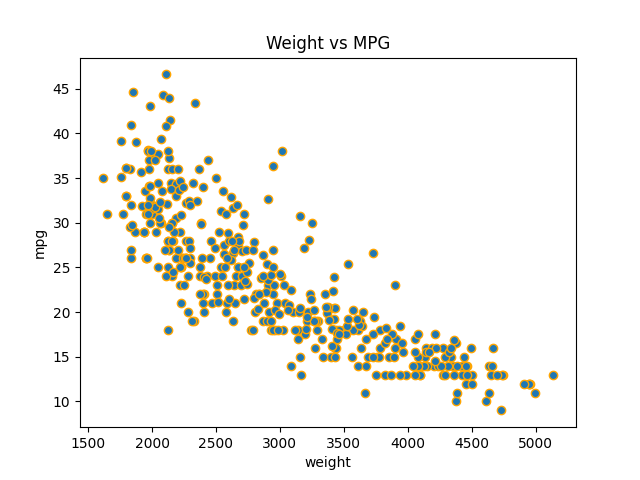
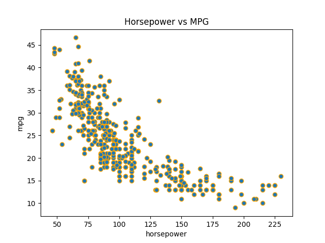
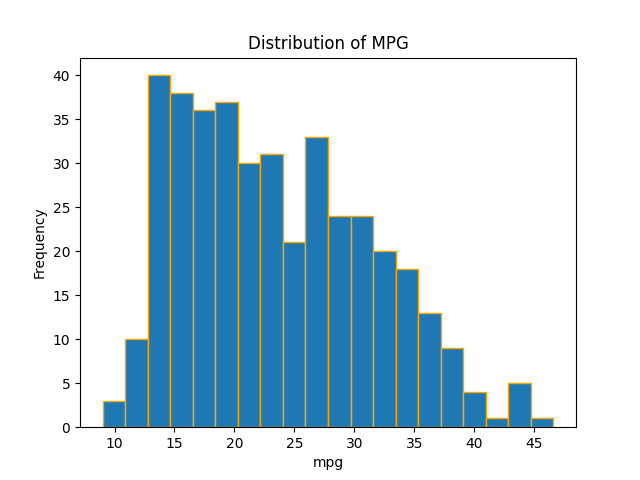
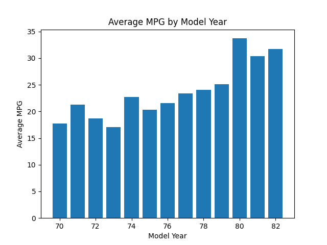

# Auto MPG - Fuel Efficiency Analysis

## Description
This project analyzes the Auto MPG dataset to understand which factors such as weight, horsepower, and model year affect a car's fuel efficiency (MPG). Working from a Junior Data Analyst scenario for an automobile company, the goal was to clean the dataset, explore relationships through visualizations, and draw simple, data-backed conclusions.

## Dataset
Source: [Auto MPG Dataset](https://raw.githubusercontent.com/plotly/datasets/master/auto-mpg.csv)

**Key columns:**
- `mpg` → Fuel efficiency
- `cylinders` → Number of cylinders
- `horsepower` → Engine power
- `weight` → Car weight
- `acceleration` → Acceleration
- `model_year` → Model year
- `origin` → Car origin

## Tools Used
Python | Pandas | NumPy | Matplotlib | Google Colab

## Steps Performed
1. Loaded and explored the dataset structure
2. Cleaned missing `horsepower` values (converted to numeric, filled with median) and removed duplicate rows
3. Calculated basic statistics — mean, minimum, and maximum MPG
4. Filtered cars based on MPG, horsepower, and weight thresholds
5. Created 4 visualizations to explore relationships in the data
6. Calculated the probability of a car having MPG greater than 30

## Key Statistics
| Metric | Value |
|---|---|
| Mean MPG | 23.51 |
| Minimum MPG | 9.0 |
| Maximum MPG | 46.6 |

## Visualizations

*Weight vs MPG — shows how car weight relates to fuel efficiency*

*Horsepower vs MPG — shows how engine power relates to fuel efficiency*

*Distribution of MPG values across all cars in the dataset*

*Average fuel efficiency trend across model years*

## Findings
1. Heavier cars tend to have lower fuel efficiency, showing a negative relationship between weight and MPG.
2. Cars with higher horsepower generally achieve lower MPG, since more powerful engines tend to consume more fuel.
3. The average fuel efficiency across the dataset is **23.51 MPG**, with a wide range from as low as **9.0** to as high as **46.6**.
4. Fuel efficiency shows a trend across model years, suggesting changes in engineering and fuel efficiency standards over time.
5. Only about **21.36%** of cars in the dataset achieve an MPG greater than 30, indicating that highly fuel-efficient cars are relatively uncommon in this dataset.

## Probability Result
**P(MPG > 30) = 21.36%**

---
*This project was completed as part of the NIAI (NetSol Institute of AI) training program.*
